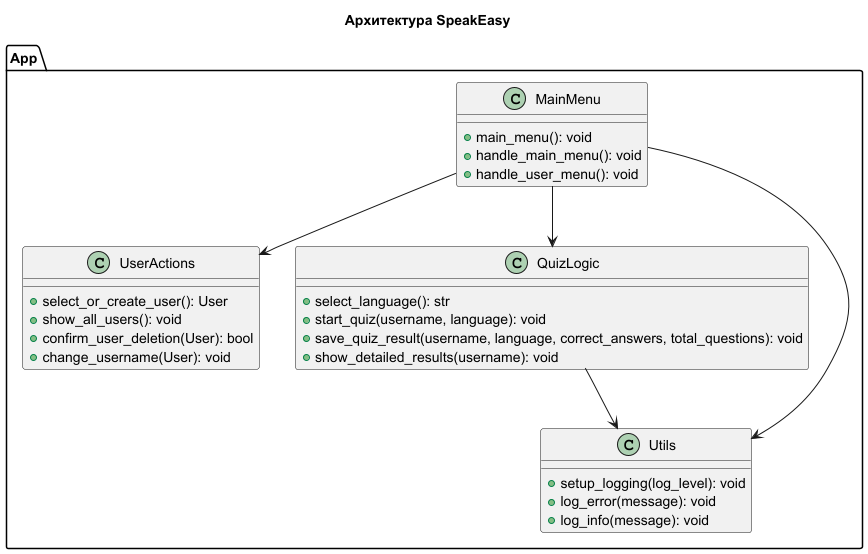
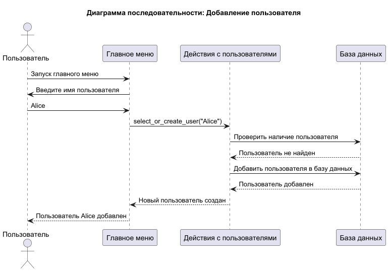
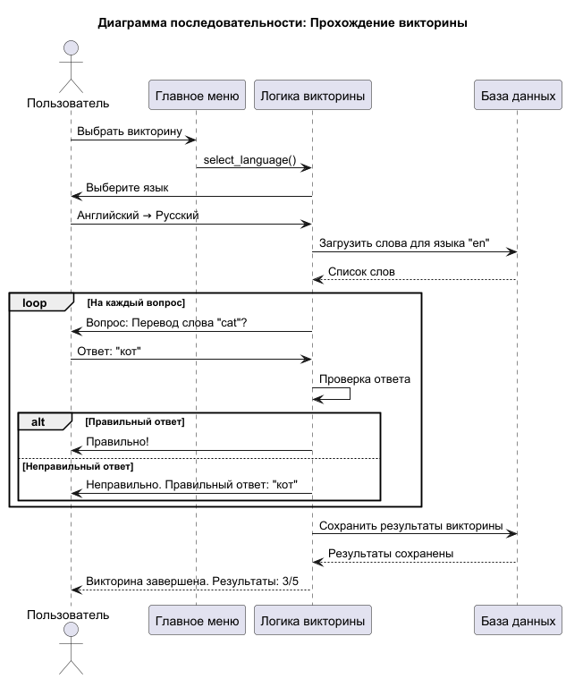

# SpeakEasy

## Описание

**SpeakEasy** — это приложение для изучения иностранных слов. Оно поддерживает:
- Многопользовательский режим.
- Викторины с выбором языка.
- Хранение статистики и детализированных результатов.
- Работа с базой данных SQLite.
- Логирование и управление пользователями.
- Поддержка веб-интерфейса с использованием FastAPI.

---

## Структура проекта

| Директория/Файл      | Описание                            |
|----------------------|-------------------------------------|
| `app/`               | Логика приложения                   |
| ├── `__init__.py`    | Инициализация пакета                |
| ├── `menu.py`        | Консольное меню                     |
| ├── `db.py`          | Работа с базой данных               |
| ├── `models.py`      | Управление пользователями           |
| ├── `utils.py`       | Утилиты (логирование)               |
| ├── `quiz_logic.py`  | Логика викторин                     |
| ├── `user_actions.py`| Логика действий с пользователями    |
| └── `main_fastapi.py`| Веб-приложение на FastAPI           |
| `data/`              | Хранение данных                     |
| └── `data.db`        | База данных SQLite                  |
| `docs/`              | Документация проекта                |
| ├── `main.puml`      | Диаграммы архитектуры               |
| ├── `main_SpeakEasy.png` | Сгенерированная диаграмма архитектуры |
| ├── `main_add_user.png`  | Диаграмма последовательности: добавление пользователя |
| └── `main_quiz_logic.png`| Диаграмма последовательности: прохождение викторины |
| `logs/`              | Логи приложения                     |
| └── `app.log`        | Основной лог-файл                   |
| `tests/`             | Автотесты                           |
| ├── `test_models.py` | Тестирование моделей                |
| ├── `test_data.py`   | Тестирование работы с данными       |
| `main.py`            | Точка входа в приложение            |
| `requirements.txt`   | Зависимости проекта                 |
| `README.md`          | Документация                        |

---

## Установка и запуск

### 1. Установка зависимостей
Убедитесь, что у вас установлен Python версии 3.10 или выше, затем выполните:
```bash
pip install -r requirements.txt
```

### 2. Подготовка базы данных
Проверьте, что файл базы данных `data.db` находится в папке `data/`. Если файла нет, создайте его:
```bash
python -c "from app.db import initialize_database; initialize_database()"
```

### 3. Запуск приложения
Для запуска приложения в консольном режиме выполните:
```bash
python main.py --mode console
```

Для запуска веб-интерфейса выполните:
```bash
python main.py --mode api
```

### 4. Запуск тестов
Чтобы проверить, что всё работает корректно, выполните:
```bash
pytest tests/
```

---

## Диаграммы проекта

### Архитектура приложения
Диаграмма классов, отображающая основные модули и их взаимодействие:



### Добавление пользователя
На диаграмме показан процесс добавления нового пользователя:



### Процесс прохождения викторины
На диаграмме показан процесс взаимодействия пользователя с системой во время викторины:



---

## Примеры использования

### 1. Консольное меню
Запустите приложение в консольном режиме и выполните:
- Выберите опцию "1. Управление пользователями" для добавления или выбора пользователя.
- Выберите "Пройти викторину" для изучения иностранных слов.

### 2. Веб-интерфейс
- Запустите приложение в режиме API.
- Перейдите по адресу `http://127.0.0.1:8000/docs`, чтобы увидеть документацию API.

---

## План доработок

- Реализовать тестирование всех компонентов через CI/CD.
- Улучшить логику работы с базой данных и расширить тесты.
- Добавить возможность загрузки данных через веб-интерфейс.

---

